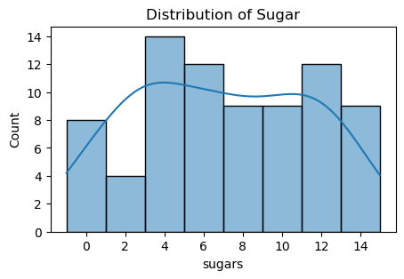

# LAPORAN PROYEK MESIN LEARNING

### Nama : Raufan Ahsan Haerizal

### Nim : 211351119

### Kelas : Pagi A

## Domain Proyek

Proyek ini dapat digunakan untuk Mencari Berat Dari Cereal Membangun sistem otomatis untuk mengukur dan mengisi berat cereal ke dalam kemasan. Ini dapat mencakup penggunaan berat yang tepat untuk masing-masing kemasan atau porsi.

## Business Understanding

memproduksi dan memasarkan sereal yang membantu individu dalam pengelolaan berat badan dengan memberikan pilihan makanan rendah kalori dan tinggi serat.

### Problem Statements

Dalam Kasus ini ,mencari kekurangnya pilihan makanan rendah kalori yang memadai dan bergizi di pasar saat ini membuat individu yang ingin mengelola berat badan kesulitan dalam memenuhi kebutuhan gizi mereka tanpa melebihi asupan kalori harian.

### Goals

Menentukan Berat dari cereal terlalu berat atau tidak.

### Solution statements

 panduan atau rencana tindakan yang akan membantu dalam mengatasi masalah atau mencapai tujuan yang terkait dengan produk sereal atau bisnis yang berkaitan dengan sereal.

 ## Data Understanding

 Dataset yang saya gunakan berasal dari Kaggle yang berisi 80 Cereals. Dataset ini merupakan sekumpulan data yang dikumpulkan dari website 80 Cereal. Dataset ini mengandung lebih dari 10 columns setelah dilakukan data cleaning..
 <br>
 [80 Cereals] (https://www.kaggle.com/datasets/crawford/80-cereals)

### Variabel-variabel pada 80 Cereals adalah sebagai berikut:
calories = Masukan Calorie
protein =  Masukan protein
fat = Masukan Fat
sodium = Masukan Sodium
fiber = Masukan Fiber
carbo = Masukan Carbo
sugars = Masukan Sugar
rating = Masukan Rating dari cereal

## Data Preparation

### Data Collection
Untuk data collection ini, saya mendapatkan dataset yang nantinya digunakan dari website kaggle dengan nama dataset 80 Cereals, jika anda tertarik dengan datasetnya, anda bisa click link diatas.

### Data Discovery And Profiling
Untuk bagian ini, kita akan menggunakan teknik EDA. <br>
Pertama kita mengimport semua library yang dibutuhkan,
``` bash
import numpy as np 
import pandas as pd 
import matplotlib.pyplot as plt
import seaborn as sns
from sklearn.ensemble import RandomForestRegressor

import os
for dirname, _, filenames in os.walk('/kaggle/input'):
    for filename in filenames:
        print(os.path.join(dirname, filename))
```
Mari lanjut dengan memasukkan file csv yang telah diextract pada sebuah variable, dan melihat 5 data paling atas dari datasetsnya
``` bash
df = pd.read_csv('cereal.csv')
df.head()
```
Untuk melihat mengenai type data dari masing masing kolom kita bisa menggunakan property info,
``` bash
df.info()
```
``` bash
print("Dataset Columns and rows:", df.shape)
print("Dataset size:", df.size)
```
``` bash
df.describe()
```
Mari kita lanjut dengan data exploration kita,
``` bash
plt.figure(figsize=(8,6))
plt.title("Overall Cereals Data Distribution")
sns.histplot(data = cereals)
```
mengecek atau memastikan kalo yang null itu true atau false,
``` bash
cereals.isnull().any()
```
lalu check mengunakan yand di bawah dan bakal keluar hasilnya,
``` bash
cereals.duplicated().any()
```
## Modeling
Fungsi ini akan membuat gambar atau model grafik
``` bash
def plot_histogram(column_data, column_name):
    plt.figure(figsize=(5, 3))
    plt.title(f"Distribution of {column_name}")
    sns.histplot(column_data, kde=True) 
    plt.show()
```


lalu ini memunculkan grafik manufacturer
``` bash
plot_histogram(cereals['mfr'], 'Manufacturer')
```


ini memunculkan grafik type 
``` bash
plot_histogram(cereals['type'], 'Cold or Hot Types of Cereal')
```


ini memunculkan grafik calories
``` bash
plot_histogram(cereals['calories'], 'Calories')
```


ini memunculkan grafik protein
``` bash
plot_histogram(cereals['protein'], 'Protein')
```


ini memunculkan grafik fat
``` bash
plot_histogram(cereals['fat'], 'Fat')
```


ini memunculkan grafik sodium
``` bash
plot_histogram(cereals['sodium'], 'Sodium')
```


ini memunculkan grafik potass
``` bash
plot_histogram(cereals['potass'], 'potass')
```


ini memunculkan grafik rating
``` bash
plot_histogram(cereals['rating'], 'Consumer Rating')
```


ini memunculkan grafik sugar
``` bash
plot_histogram(cereals['sugars'], 'Sugar')
```

Kode ini menunjukkan bagaimana Anda mengambil beberapa fitur (features)
``` bash
features = ['calories','protein','fat','sodium','fiber','carbo','sugars','rating']
x = df[features]
y = df['weight']
x.shape, y.shape
```
Kode ini menunjukkan model selection (features)
``` bash
from sklearn.model_selection import train_test_split
x_train, X_test, y_train, y_test = train_test_split(x,y,random_state=100)
y_test.shape
```
lalu ini untuk memindahkan linier model ke linear regression
``` bash
from sklearn.linear_model import LinearRegression
lr = LinearRegression()
lr.fit(x_train,y_train)
pred = lr.predict(X_test)
```
ini code untik memunculkan akurasi dari regresi linier
``` bash
score = lr.score(X_test, y_test)
print('akurasi model regresi linier = ', score)
```
lalu masukan data sesuai yang kalian masukan ke features dan prediction
``` bash
input_data = np.array([[120,3,5,15,2,8,8,33.983679]])

prediction = lr.predict(input_data)
print('Estimasi nilai weaght di dalam creal :', prediction)
```
wow, berhasil!!, sekarang modelnya sudah selesai, mari kita export sebagai sav agar nanti bisa kita gunakan pada project web streamlit kita.
``` bash
import pickle

filename = 'estimasi_creal.sav'
pickle.dump(lr,open(filename,'wb'))
```

## Evaluation
Disini saya menggunakan linear regression buat memunculkan akurasi.
- regresi linear untuk memodelkan hubungan antara atribut-atribut tersebut dan bobot (weight) suatu produk makanan. 

- Setelah itu saya menerapkannya dalam kode menggunakan fungsi linier regression, seperti berikut :
``` bash 
from sklearn.linear_model import LinearRegression
lr = LinearRegression()
lr.fit(x_train,y_train)
pred = lr.predict(X_test)

score = lr.score(X_test, y_test)
print('akurasi model regresi linier = ', score)
```
dan hasil yang saya dapatkan adalah 0.0.8429417917724311 atau 84.2%, itu berarti model ini memiliki keseimbangan yang baik antara presisi dan recall. Karena kita mencari patokan harga untuk membeli Apartment maka model yang presisi sangat dibutuhkan agar kemungkinan terjadinya kesalahan semakin sedikit.

## Deployment

[My Estimation App](https://80cereal-raufan.streamlit.app/).


